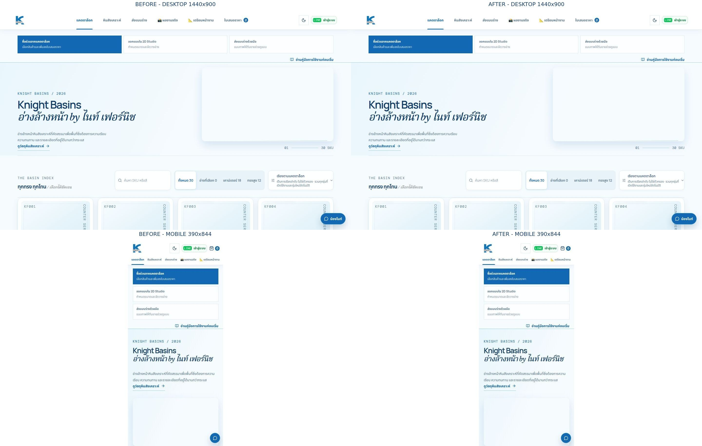
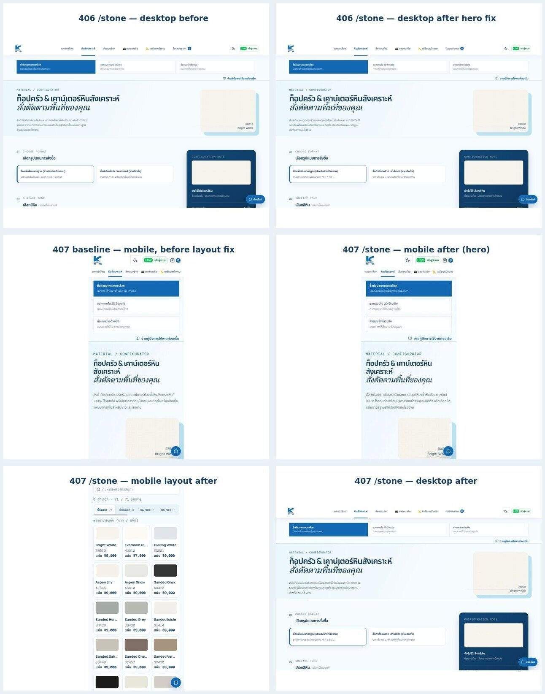
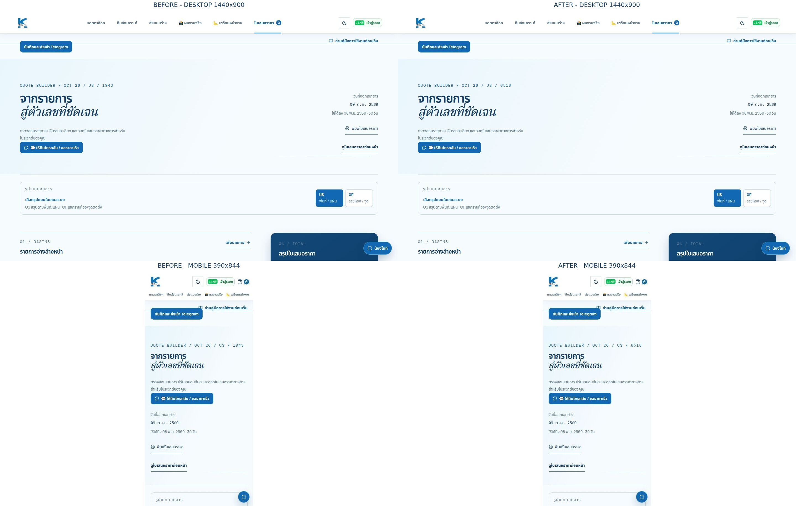

# 407-R — `/stone` mobile overflow (continuation of 406-R)

**Status:** The `/stone` mobile overflow is fixed and verified locally. PR #449 is open and ready for review; it was not merged, and no production deploy was performed.  
**Evidence checked:** 2026-10-09 23:27 Asia/Bangkok  
**Preview origin:** `http://127.0.0.1:80`  
**Branch:** `fix/replit-hero-horizontal-overflow`  
**Previous branch head:** `ee56db15ae2e8d7b33896ccc08b3efb80c6771e7`; the final 407-R head is verified in PR #449 metadata and reported at delivery.

## What changed

The three hero pseudo-elements previously used `inset: 0 -20vw`. That made their paint boxes wider than the page and caused horizontal scrolling. Setting `inset: 0` removed the scroll in most cases but also narrowed the visible gradient.

The fix extends each pseudo-element only to the matching `.page-wrap` gutter, `clamp(18px, 5vw, 76px)`, then adds the same two gutters back into `background-size`. This keeps the original 20vw bleed width and centered gradient, while bounding the pseudo-element to the page-wrap edges. It does not use `overflow` clipping on `html` or `body`, and does not modify pricing, API data, `index.html`, `/admin`, or `/price-guide`.

The browser measurement confirmed that each pseudo-element spans exactly the document client width: 1,425px on the three desktop target pages and 390px on mobile. The side-by-side captures show the gradient still reaching both viewport edges at its original scale. The preview continued to report certificate errors for remote image resources, so those images were unavailable in both sets of captures; the CSS gradient itself was visible.

407-R leaves that shared hero rule unchanged. The gradient remains visible on `/stone`; its pseudo-element measures `inset: 0 -19.5px` on mobile and `0 -72px` on desktop, with the original calculated background scale.

## Measurements

The production values below are the baseline supplied with this assignment; no production writes were made.

### Supplied production baseline

| Viewport | `/` | `/stone` | `/quote` | `/price-guide` |
|---|---:|---:|---:|---:|
| 1440×900 | 1425→1641 (**216px**) | 1425→1641 (**216px**) | 1425→1641 (**216px**) | 1425→1425 (**0px**) |
| 390×844 | 390→449 (**59px**) | 390→478 (**88px**) | 390→449 (**59px**) | Not supplied |

Each cell is `clientWidth → scrollWidth (overflow)`.

### Local preview before and after 406-R

This is the 406-R snapshot. Its `/stone` mobile result (80px overflow) is the baseline for 407-R, not the final result.

| Route | Viewport | Before | After |
|---|---|---:|---:|
| `/` | 1440×900 | 1425→1641 (**216px**) | 1425→1425 (**0px**) |
| `/stone` | 1440×900 | 1425→1641 (**216px**) | 1425→1425 (**0px**) |
| `/quote` | 1440×900 | 1425→1641 (**216px**) | 1425→1425 (**0px**) |
| `/price-guide` | 1440×900 | 1440→1440 (**0px**) | 1440→1440 (**0px**) |
| `/` | 390×844 | 390→449 (**59px**) | 390→390 (**0px**) |
| `/stone` | 390×844 | 390→470 (**80px**) | 390→470 (**80px**) |
| `/quote` | 390×844 | 390→449 (**59px**) | 390→390 (**0px**) |
| `/price-guide` | 390×844 | 390→390 (**0px**) | 390→390 (**0px**) |

The `/price-guide` preview response is the SPA fallback; its document returned HTTP 200 and remained at zero overflow. The local desktop client width is 1,440px there because that page has no vertical scrollbar; the target pages report 1,425px at the same 1,440px viewport.

### 407-R `/stone` mobile isolation and final measurements

The supplied production baseline is distinct from the local preview: production measured 390→478 (88px); hiding `.stone-hero` left 478px, while hiding `.config-layout` or `.config-layout > .config-main` left 449px. No production changes or requests were made.

In the local 407-R baseline at 390×844, `/stone` measured 390→470 (80px). To restore the pre-407 CSS in the browser, only the added 407 media rule was temporarily removed from the CSSOM; no workspace source was changed. Each isolation probe then used `element.style.display = "none"` on one candidate at a time and reset it before the next probe:

| One element hidden | `scrollWidth` | Overflow |
|---|---:|---:|
| None (baseline) | 470px | 80px |
| `.stone-hero` | 470px | 80px |
| `.config-layout` | 390px | 0px |
| `.config-layout > .config-main` | 390px | 0px |
| `.stone-colors` | 463px | 73px |
| `.stone-search-row` | 470px | 80px |
| `.stone-search-row > span` | 470px | 80px |
| `.stone-price-filters` | 470px | 80px |

`[data-sonner-toaster]` was absent during the probe.

The fix stacks the search and selection summary on mobile, permits the summary to wrap, and constrains the three stone-card tracks to `minmax(0, 1fr)`. Before the fix the summary reached x=463. Afterward the mobile grid tracks measured about 112.33px each; both the grid and summary ended at x=370.5 inside the 390px viewport.

| Route | Viewport | Final measurement |
|---|---|---:|
| `/` | 1440×900 | 1425→1425 (**0px**) |
| `/stone` | 1440×900 | 1425→1425 (**0px**) |
| `/quote` | 1440×900 | 1425→1425 (**0px**) |
| `/price-guide` | 1440×900 | 1440→1440 (**0px**) |
| `/` | 390×844 | 390→390 (**0px**) |
| `/stone` | 390×844 | 390→390 (**0px**) |
| `/quote` | 390×844 | 390→390 (**0px**) |
| `/price-guide` | 390×844 | 390→390 (**0px**) |

Each cell is `clientWidth → scrollWidth (overflow)`. The 407-R route and viewport checks used the local preview, not production.

### Measurement used

At 1440×900 and 390×844, in the preview page console:

```js
(() => {
  const d = document.documentElement;
  return {
    clientWidth: d.clientWidth,
    scrollWidth: d.scrollWidth,
    over: d.scrollWidth - d.clientWidth,
  };
})()
```

### 407-R resolution and scope

The isolated cause was in the `/stone` configuration area, not its hero. The local final measurement is 390→390; the summary and three-column color grid both end within the page. The fix changes only the mobile storefront layout rules. It does not add root `html`/`body` overflow clipping or alter the hero, product data, pricing, or `/price-guide`.

## Regression and route checks

- The 406-R hero regression test against its pre-fix stylesheet failed as required (`0 -20vw` versus the bounded inset); it passes with the preserved hero rule.
- The 407-R mobile-layout regression test against the pre-407 stylesheet failed as required with `AssertionError: the mobile storefront styles must contain the stone grid`; against the fix: **2 passed, 0 failed** across the hero and mobile-layout checks.
- `pnpm --filter @workspace/knight-basins run typecheck`: **passed**.
- CI-equivalent non-`*.browser.test.ts` test set: **1,120 passed, 0 failed, 0 skipped**.
- The full browser suite was not rerun for 407-R. In the earlier 406-R verification, an unfiltered run reported browser timeout/race failures and a serialized attempt exceeded 300 seconds; those are not represented as passing.
- All 12 public preview routes returned HTTP 200 in this continuation: `/`, `/portfolio`, `/stone`, `/quote`, `/studio`, `/sketch`, `/site-prep`, `/studio-guide`, `/readme`, `/updates`, `/track`, and `/handover`. Overflow was rechecked on `/`, `/stone`, `/quote`, and `/price-guide` at both target sizes.
- No production POST, PUT, or DELETE requests were made.

## Before/after screenshots

The six-panel stone comparison includes the 406-R desktop before/after captures, the 407-R mobile baseline and final captures, a scrolled mobile view of the corrected grid, and the final desktop view. The mobile baseline is the 406-R-after / 407-R-before state.

### Home — `/`



### Stone — `/stone`



### Quote — `/quote`



## Files in PR #449

The PR remains limited to six files: `src/index.css`, `test/hero-overflow.test.ts`, this report, and the three comparison images. It does not change any out-of-scope source or data files.
