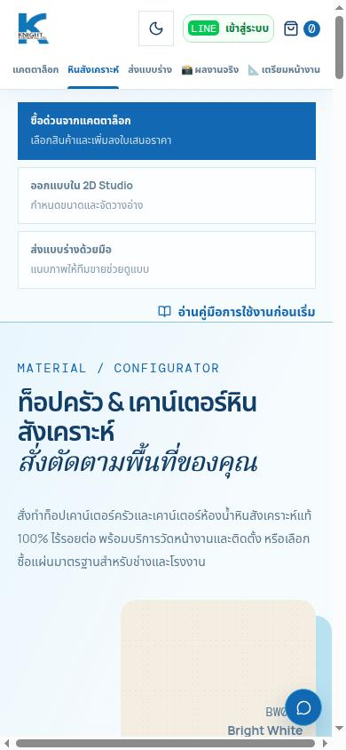
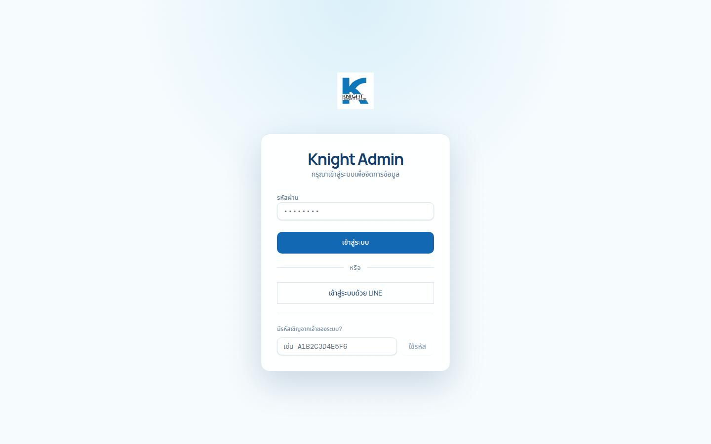

# รายงานตรวจแอป Knight Basins รอบ 5 — ใบงาน 408-R

## ผลวัดซ้ำล่าสุด — ยังไม่ผ่านเกณฑ์รับงาน

ตรวจ production ซ้ำวันที่ 10 ต.ค. 2569 ประมาณ 00:27–00:31 น. เวลาไทย
(timestamp `2026-10-09T17:28:49.258Z`) อ้าง source main จาก GitHub Connection
`ae522d9d21230a2a3bb6b31616e72412a51ac116`.
ใช้ Chromium desktop/headless, `mobile:false`, scale 1 และปิด overlay scrollbar;
ยืนยัน scrollbar คลาสสิก 15px จาก `innerWidth − clientWidth`.
ผลวัดซ้ำนี้ **แทนที่ข้ออ้าง overflow 0 ทุกช่องในบันทึกเดิม**:
`/stone` มือถือ +2px และ `/readme` มือถือ +12px ได้แจ้งในแชททันทีแล้ว
โดยไม่แก้ CSS หรือ source code.

บันทึก C/D ด้านล่างเป็นผลรอบก่อนที่มีอยู่ใน workspace ไม่ใช่ผลทดสอบซ้ำในรอบนี้.
รอบล่าสุดเลือกสีได้เพียง 3 สีจริง (Bright White ฿5,900,
Evermoin Ultra Bright ฿7,500, Glaring White ฿9,000; ชื่อ/ราคาสรุปตรงกัน)
และไม่สามารถตรวจฟอร์ม preview ซ้ำจนสำเร็จ:
container-local `/knight-basins/quote` แสดง SPA 404;
การลอง development domain ต่อมาจบด้วย CDP `Runtime.evaluate: Uncaught`.
**ไม่มีการส่ง quote ไป production**.
หยุดการตรวจเพิ่มเติมตาม turn-limit ของใบงาน และระบุสิ่งที่ยังยืนยันซ้ำไม่ได้ตามจริง.

### Width metrics ล่าสุด

ค่าล้น = `document.documentElement.scrollWidth − clientWidth`.
ทุก 30 document response = HTTP 200; body render ครบ; console errors/uncaught
exceptions ที่สังเกต = 0. `/track` และ `/handover` เป็นหน้ารับ private link,
ไม่ได้เปิดลิงก์ลูกค้าจริง; admin เป็นหน้า login.

| Route | 1440×900 inner/client/scroll → px | 390×844 inner/client/scroll → px |
|---|---|---|
| `/` | 1440/1425/1425 → 0 | 390/375/375 → 0 |
| `/portfolio` | 1440/1425/1425 → 0 | 390/375/375 → 0 |
| `/stone` | 1440/1425/1425 → 0 | 390/375/377 → **2** |
| `/quote` | 1440/1425/1425 → 0 | 390/375/375 → 0 |
| `/updates` | 1440/1425/1425 → 0 | 390/375/375 → 0 |
| `/price-guide` | 1440/1425/1425 → 0 | 390/375/375 → 0 |
| `/site-prep` | 1440/1425/1425 → 0 | 390/375/375 → 0 |
| `/studio` | 1440/1425/1425 → 0 | 390/375/375 → 0 |
| `/studio-guide` | 1440/1425/1425 → 0 | 390/375/375 → 0 |
| `/sketch` | 1440/1425/1425 → 0 | 390/375/375 → 0 |
| `/readme` | 1440/1425/1425 → 0 | 390/375/387 → **12** |
| `/network` | 1440/1425/1425 → 0 | 390/375/375 → 0 |
| `/track` | 1440/1425/1425 → 0 | 390/375/375 → 0 |
| `/handover` | 1440/1425/1425 → 0 | 390/375/375 → 0 |
| `/admin` | 1440/1440/1440 → 0 | 390/390/390 → 0 |

| องค์ประกอบที่อยู่นอก clientWidth | ขอบจริง | ข้อสังเกต |
|---|---|---|
| `/stone`: `div.quantity-editor.large` | left 20, right 377, client 375 | ไม่พบ scrollable ancestor; overflow-x ของตัวเอง hidden แต่ border box ยังเลยขอบ |
| `/readme`: company badge, heading, wrapper | left 84, right 387, client 375 | badge ใช้ whitespace-nowrap |

นี่เป็นตัวการที่สังเกตจาก DOM ยังไม่ใช่ข้อพิสูจน์เชิง source ว่า price chips เป็นต้นเหตุ.
ตัวเลขต่างจาก baseline ใน 411-R จึงต้องวัดใหม่ก่อนแก้.
รูปที่โหลดแล้วไม่พบ `complete && naturalWidth === 0`; ยังไม่ได้บังคับโหลด
lazy images ทุกส่วนล่างของหน้า จึงไม่อ้างว่ารูปทั้งหมดทั้งหน้าได้รับการตรวจครบ.

### ยืนยันซ้ำ catalog / guide / admin / รูป

- Catalog GET 200, JSON 112,642 bytes: 64 sheet / 65 installed / 30 basins.
- ทั้ง 7 hidden codes ไม่ปรากฏในสอง stone arrays.
- Sheet-mode UI มี 64 color controls + 64 slab-open controls ไม่ใช่ 128 สี.
- Guide min/max ตรง API: sheet 4,900–12,000; installed 7,500–12,000;
  basin 16,000–32,000; VAT 7%; ค่าขั้นต่ำงาน 5,000/8,000 และ 5/10m²;
  ขนาดแผ่น 0.76×3.60m หนา12mm.
- `/admin`, `/admin/sheet-stones`, `/admin/installed-stones`: 200,
  login UI และ console 0; ไม่ล็อกอิน.
- 386 unique image URL fields มี old host 0 จุด. ตัวอย่างสุ่มใหม่ 10 URL:

| URL relative to `https://knightbasins.com` | HTTP | MIME | bytes | old host |
|---|---:|---|---:|---|
| `/api/uploads/catalog-mus94eqp-e28f723f4ae904f3.jpg?v=mus94eqp` | 200 | image/jpeg | 3823 | no |
| `/api/uploads/catalog-mur94dff-df432003a5f92e59.jpg?v=mur94dff` | 200 | image/jpeg | 42651 | no |
| `/api/uploads/catalog-mur7pz54-03ce76958134fcd0.jpg?v=mur7pz54` | 200 | image/jpeg | 74666 | no |
| `/api/uploads/catalog-mu46wvhb-f9791b8dee288951.png?v=mu46wvhb` | 200 | image/png | 131631 | no |
| `/kb/images/slab/GG884.png` | 200 | image/png | 3743892 | no |
| `/api/uploads/catalog-mur8zlyo-5536dbf2810b6436.jpg?v=mur8zlyo` | 200 | image/jpeg | 46873 | no |
| `/api/uploads/catalog-mur8kfjk-4ba64f13d0ef5d3d.jpg?v=mur8kfjk` | 200 | image/jpeg | 52629 | no |
| `/api/uploads/catalog-mu46yc4c-8a1155e747f38554.png?v=mu46yc4c` | 200 | image/png | 27030 | no |
| `/kb/images/slab/GE118.png` | 200 | image/png | 483366 | no |
| `/kb/images/slab/MB025.png` | 200 | image/png | 553424 | no |

### ผลทดสอบซ้ำใน workspace

`pnpm --filter @workspace/knight-basins run typecheck`: **exit 0**.
`timeout 270s pnpm --filter @workspace/knight-basins test`: **exit 124**.
ก่อน outer timeout runner รายงาน **1145 tests / 1123 pass / 21 fail / 1 cancelled**.
ตัวอย่าง failures: stock-response browser, admin-upload browser,
partial-customer formal quote, Studio mobile; หลายข้อ timeout.
จึงไม่ผ่านเกณฑ์ zero failures. หยุด API workflow ก่อน suite เพื่อแยก dist builds.
Workspace App.tsx ต่างจาก remote main: ผลนี้ไม่ใช่การยืนยัน isolated main snapshot.

### ภาพ production รอบวัดซ้ำล่าสุด (first viewport)

[Home 1440](evidence/round5-408/home-1440.jpg) ·
[Stone 1440](evidence/round5-408/stone-1440.jpg) ·
[Stone 390](evidence/round5-408/stone-390.jpg) ·
[Quote 1440](evidence/round5-408/quote-1440.jpg) ·
[Guide 1440](evidence/round5-408/price-guide-1440.jpg) ·
[Admin login 1440](evidence/round5-408/admin-1440.jpg).
Stone 390 screenshot เห็น horizontal scrollbar จริง.

## บันทึกรอบก่อน — เก็บไว้เพื่อ provenance ไม่ใช่ข้ออ้างว่าตรวจซ้ำครบ

- ตรวจเมื่อ: 10 ต.ค. 2569 เวลา 00:12 น. (Asia/Bangkok, UTC+07:00)
- Production origin: `https://knightbasins.com` (เปิด apex โดยตรง; production ตรวจด้วย GET/HEAD เท่านั้น)
- Preview: Knight Basins web preview และ API ภายใน workspace; ใช้ preview เท่านั้นสำหรับการส่งใบเสนอราคา
- Source snapshot ที่อ่านผ่าน GitHub Connection: branch `main`, HEAD `db0c5f6500e4d6c84f25273dd2c37db7e5f37523` (ยืนยันเวลา 10 ต.ค. 2569 00:03:20 น. เวลาไทย)
- ขอบเขต: ไม่แก้ app code, production data หรือ production database; ไม่มี commit, push, deploy หรือ merge. สร้างรายการทดสอบสังเคราะห์หนึ่งรายการผ่าน API ของ local preview ตามข้อกำหนดให้ทดสอบการส่งจริงใน dev/preview เท่านั้น

## A. หน้า public 15 หน้า × 2 ขนาดจอ

เกณฑ์ในคอลัมน์แต่ละจอ: HTTP status · เนื้อหาหลักเรนเดอร์ · console errors · รูปแตก · overflow แนวนอน (px) ทุกหน้าผ่านโดยไม่มี failed network requests เพิ่มเติม

| Route (production) | Desktop 1440×900 | Mobile 390×844 |
|---|---|---|
| [`/`](https://knightbasins.com/) | 200 · ผ่าน · 0 · 0 · 0 | 200 · ผ่าน · 0 · 0 · 0 |
| [`/portfolio`](https://knightbasins.com/portfolio) | 200 · ผ่าน · 0 · 0 · 0 | 200 · ผ่าน · 0 · 0 · 0 |
| [`/stone`](https://knightbasins.com/stone) | 200 · ผ่าน · 0 · 0 · 0 | **superseded: latest overflow +2** |
| [`/quote`](https://knightbasins.com/quote) | 200 · ผ่าน · 0 · 0 · 0 | 200 · ผ่าน · 0 · 0 · 0 |
| [`/updates`](https://knightbasins.com/updates) | 200 · ผ่าน · 0 · 0 · 0 | 200 · ผ่าน · 0 · 0 · 0 |
| [`/price-guide`](https://knightbasins.com/price-guide) | 200 · ผ่าน · 0 · 0 · 0 | 200 · ผ่าน · 0 · 0 · 0 |
| [`/site-prep`](https://knightbasins.com/site-prep) | 200 · ผ่าน · 0 · 0 · 0 | 200 · ผ่าน · 0 · 0 · 0 |
| [`/studio`](https://knightbasins.com/studio) | 200 · ผ่าน · 0 · 0 · 0 | 200 · ผ่าน · 0 · 0 · 0 |
| [`/studio-guide`](https://knightbasins.com/studio-guide) | 200 · ผ่าน · 0 · 0 · 0 | 200 · ผ่าน · 0 · 0 · 0 |
| [`/sketch`](https://knightbasins.com/sketch) | 200 · ผ่าน · 0 · 0 · 0 | 200 · ผ่าน · 0 · 0 · 0 |
| [`/readme`](https://knightbasins.com/readme) | 200 · ผ่าน · 0 · 0 · 0 | **superseded: latest overflow +12** |
| [`/network`](https://knightbasins.com/network) | 200 · ผ่าน · 0 · 0 · 0 | 200 · ผ่าน · 0 · 0 · 0 |
| [`/track`](https://knightbasins.com/track) | 200 · ผ่าน · 0 · 0 · 0 | 200 · ผ่าน · 0 · 0 · 0 |
| [`/handover`](https://knightbasins.com/handover) | 200 · ผ่าน · 0 · 0 · 0 | 200 · ผ่าน · 0 · 0 · 0 |
| [`/admin`](https://knightbasins.com/admin) | 200 · ผ่าน · 0 · 0 · 0 | 200 · ผ่าน · 0 · 0 · 0 |

## B. ตรวจ horizontal overflow

ใช้ expression ตามใบงานกับ `document.documentElement` ในทุก route และ viewport:

```js
(() => {
  const d = document.documentElement;
  return d.scrollWidth - d.clientWidth;
})()
```

ข้ออ้างเดิมว่า 0 ทุกช่องถูกแทนที่ด้วยตาราง desktop/classic-scrollbar ล่าสุดด้านบน.

## C. `/stone` และ `/price-guide`

Production `GET https://knightbasins.com/api/catalog` ตอบ `200`:

| รายการ | ผล |
|---|---:|
| แผ่นหิน (`sheetStones`) | 64 |
| หินพร้อมติดตั้ง (`installedStones`) | 65 |
| อ่าง (`basins`) | 30 |
| รหัสสินค้าหมดที่ต้องซ่อน: BL461, KZ695, RC469, SL531, VD126, VL155, V342 | ไม่พบในสองรายการหิน และไม่เป็นตัวเลือกบนหน้าเว็บ |

หน้า `/stone` แสดง 64/64 สีในโหมดแผ่น และ 65 สีในโหมดติดตั้ง กดเลือกสีแล้ว `aria-pressed` เปลี่ยนเป็น `true`; ชื่อและราคาแผ่นตรงกับ `basePriceTHB` ใน API ตัวอย่างสุ่ม 5 สี:

| รหัส · ชื่อ | API / UI ราคาแผ่น | ภาพรายละเอียด |
|---|---:|---|
| SS440 · Sanded Sahara | ฿9,000 | กล่องภาพเต็มแผ่นแสดงชื่อ/รหัสตรงกัน; โหลดสำเร็จ 584×722 |
| JG532M · Jade Golddust | ฿9,500 | ชื่อ/รหัสตรงกัน; โหลดสำเร็จ 785×1267 |
| SO423 · Sanded Onyx | ฿9,000 | ชื่อ/รหัสตรงกัน; โหลดสำเร็จ 518×775 |
| AP100 · Apex | ฿8,000 | ชื่อ/รหัสตรงกัน; โหลดสำเร็จ 714×1280 |
| BT010 · Basalt Terrazzo | ฿8,000 | ชื่อ/รหัสตรงกัน; โหลดสำเร็จ 782×1280 |

หน้า `/price-guide` ตรงกับช่วงที่ได้จากแคตตาล็อก production:

- ติดตั้ง: ฿7,500 / ฿8,500 / ฿9,500 / ฿12,000 ต่อตารางเมตร; ช่วงรวม ฿7,500–฿12,000
- แผ่นดิบ: ฿4,900–฿12,000 ต่อแผ่น; ขนาด 0.76 × 3.60 เมตร (2.736 ตร.ม.)
- อ่างสำเร็จรูป: ฿16,000–฿32,000 ต่อชุด
- งานเล็กในกรุงเทพฯ/ปริมณฑล: ต่ำกว่า 5 ตร.ม. ค่าดำเนินการ ฿5,000/งาน; ต่างจังหวัด: ต่ำกว่า 10 ตร.ม. ฿8,000/งาน; รับเองที่โรงงานไม่คิดค่าดำเนินการ
- VAT ที่หน้าแสดง: 7%
- ฟีด catalog ระบุส่วนลดแผ่น 10–49 แผ่น ฿200/แผ่น และ 50 แผ่นขึ้นไป 5%

## D. ใบเสนอราคา `/quote` — ทดสอบใน local preview เท่านั้น

ไม่ส่ง POST ไป production และไม่ใช้บัญชีผู้ดูแลจริง

1. **Validation:** ไม่มีช่องข้อมูลลูกค้าที่เป็น required; หน้าแจ้งว่าข้อมูลลูกค้ายังไม่ครบก็ออกใบเสนอราคาได้ จึงไม่มีกรณี “เว้นช่องบังคับของลูกค้า” ให้ทดสอบจริง หน้าแสดงข้อความเมื่อยังไม่มีสินค้า (`เพิ่มสินค้าอย่างน้อย 1 รายการก่อนออกใบเสนอราคา`). เมื่อตั้งอีเมลผิดรูปแบบ แสดง `กรุณากรอกอีเมลให้ถูกต้อง (เช่น name@example.com)`. ทั้งสองกรณีไม่มี API POST.
2. **ส่งจริงใน preview:** เลือกรายการทดสอบจาก catalog แล้วกดสร้างใบเสนอราคา. `POST /api/leads` ไปยัง local preview API ตอบ `200`; response มี `quoteNumber` และ `quoteAccessSecret` (รายงานเฉพาะการมีฟิลด์ ไม่บันทึก/ไม่เปิดเผยค่า). หน้าเปลี่ยนเป็น `/quote/view` และแสดงใบเสนอราคาที่บันทึกไว้. ไม่กดปุ่มส่ง Telegram และไม่มีการแจ้งเตือน.
3. **Mobile:** viewport 390×844; ตรวจ 15 control ที่มองเห็นได้ในฟอร์ม. ช่องไม่ทับกัน (`0` คู่), overflow `0 px`; ชื่อ, โทรศัพท์, อีเมล และชื่อโครงการ placeholder กรอกและแสดงค่าได้.

Production browser มี guard อนุญาตเฉพาะ GET/HEAD; ไม่พบคำขอเขียนและ guard ไม่ต้องบล็อกคำขอใด

## E. หน้าผู้ดูแล

เปิด production URL โดยตรงโดยไม่ล็อกอิน:

| URL | HTTP | ผลการเรนเดอร์ |
|---|---:|---|
| `https://knightbasins.com/admin/sheet-stones` | 200 | แสดง `Knight Admin`, แบบฟอร์มล็อกอิน และช่องรหัสผ่าน |
| `https://knightbasins.com/admin/installed-stones` | 200 | แสดง `Knight Admin`, แบบฟอร์มล็อกอิน และช่องรหัสผ่าน |

ทั้งสองหน้า console errors `0`; ไม่มีคำขอ non-read

## F. ตรวจ URL รูป 10 รายการ

สุ่มจากฟิลด์รูปใน production `GET /api/catalog`; ตรวจด้วย GET. ทั้ง 10 URL ตอบ 200, ชนิด MIME ตรงกับไฟล์, ขนาดเกิน 1 KB และไม่พบ `srv1964473`

| URL | HTTP | Content-Type | bytes | `srv1964473` |
|---|---:|---|---:|---|
| `https://knightbasins.com/api/uploads/catalog-mur9s724-fa222912f4a6bc11.jpg?v=mur9s724` | 200 | image/jpeg | 30,830 | ไม่พบ |
| `https://knightbasins.com/api/uploads/catalog-mur7oq8k-258d7e69d7e4f1e9.jpg?v=mur7oq8k` | 200 | image/jpeg | 57,083 | ไม่พบ |
| `https://knightbasins.com/assets/basins-transparent/KF017.webp` | 200 | image/webp | 137,340 | ไม่พบ |
| `https://knightbasins.com/api/uploads/catalog-mur6eqm5-84052239899da811.jpg?v=mur6eqm5` | 200 | image/jpeg | 53,951 | ไม่พบ |
| `https://knightbasins.com/kb/images/slab/AA625.png` | 200 | image/png | 1,187,947 | ไม่พบ |
| `https://knightbasins.com/api/uploads/catalog-mur7gszw-8fda6893295d66ad.jpg?v=mur7gszw` | 200 | image/jpeg | 52,629 | ไม่พบ |
| `https://knightbasins.com/api/uploads/catalog-mur7ioeu-126ffe5f7ee122b6.jpg?v=mur7ioeu` | 200 | image/jpeg | 245,112 | ไม่พบ |
| `https://knightbasins.com/kb/images/slab/NT970.png` | 200 | image/png | 265,302 | ไม่พบ |
| `https://knightbasins.com/api/uploads/catalog-mur7uul9-54d5574b1df1b3ee.jpg?v=mur7uul9` | 200 | image/jpeg | 42,651 | ไม่พบ |
| `https://knightbasins.com/api/uploads/catalog-mur8s1ny-56ad94719998c79b.jpg?v=mur8s1ny` | 200 | image/jpeg | 36,434 | ไม่พบ |

## G. สรุปและข้อสังเกต

- Production GET/render ยังผ่าน แต่การวัดล่าสุดพบ `/stone` +2 และ `/readme` +12; ไม่ผ่านเกณฑ์ overflow 0 ทุกช่อง.
- `/stone`, `/price-guide`, admin login และ 10/10 รูป production ผ่านเกณฑ์ที่ตรวจ
- Local preview แสดง TLS error กับ URL ภาพบน host เก่า `srv1964473` บางรายการใน `/`, `/stone` และ `/studio`; ไม่พบ host นี้ใน production routes หรือ 10 URL production ที่สุ่มตรวจ จึงเป็นข้อมูล preview ที่ต้องแยกจากปัญหา production
- ใบเสนอราคา dev ผ่านการสร้างจริงด้วยข้อมูลสังเคราะห์; ช่องข้อมูลลูกค้าไม่บังคับใน implementation ปัจจุบัน จึงไม่ได้ทดสอบ “เว้นช่องลูกค้าที่บังคับ”
- `typecheck` ผ่าน; test suite ทั้งชุดตรวจไม่จบและไม่มี aggregate summary ดูรายละเอียดหัวข้อถัดไป

### Test commands

| คำสั่ง | ผล |
|---|---|
| `pnpm --filter @workspace/knight-basins run typecheck` | ผ่าน (exit 0) |
| `pnpm --filter @workspace/knight-basins test` | **ตรวจไม่จบ**: shell timeout ที่ 300 วินาที ก่อน Node test runner สรุปผล |

ก่อน full suite หยุด API workflow ตามข้อกำหนด suite isolation; ใช้ temporary Node CLI shim เพื่อส่ง `--test-concurrency=1` เฉพาะ Node test runner โดยไม่แก้ไฟล์โครงการ. Partial output มี `✖` ใน stock response/view, admin image-upload browser flow, transparent basin-image visual regression และ long formal quote/Studio browser flow. Process จบด้วย timeout ระหว่าง long quote/Studio tests; ไม่มี final passed/failed counts หรือสาเหตุ assertion ครบ จึงไม่สรุปว่าชุดเทสต์ผ่านหรือว่าทุก failure เป็นปัญหาผลิตภัณฑ์. หลังทดสอบ restart API workflow แล้ว; server กลับมา listening ที่ port 8080.

### URL ภาพใน local preview

บน local preview `/`, `/stone` และ `/studio` พบรูปบางรายการอ้าง host เก่า `srv1964473`; Chromium ปฏิเสธ TLS. อาการนี้ไม่ปรากฏใน production catalog/page checks ข้างต้น. รอบนี้ไม่แก้ fixture, database หรือ code.

## ภาพหลักฐาน production

ภาพ desktop จับที่ 1440×900; ภาพมือถือที่ 390×844. ไฟล์อยู่ใน `qa/evidence/`.

### `/`


### `/stone`




### `/price-guide`


### `/quote`


### Admin login


## Source paths ที่อ่านผ่าน GitHub Connection

- `artifacts/knight-basins/src/App.tsx`
- `artifacts/knight-basins/src/pages/PriceGuidePage.tsx`
- `artifacts/knight-basins/src/components/StoneSlabViewer.tsx`

## สรุป 5 บรรทัด

1. **ยืนยัน:** 15 route × 2 ตอบ200/render/console0; catalog64/65/30; guide ranges/fees/VAT; admin login และภาพสุ่มใหม่10/10ผ่าน.
2. **ปัญหา:** production `/stone` มือถือ +2px และ `/readme` +12px; typecheckผ่าน แต่ full suite1123pass/21fail/1cancelled และ timeout.
3. **น่าสงสัย:** stone DOM candidate ล่าสุดคือ quantity editor ไม่ใช่ข้อพิสูจน์ว่า price-chip row เป็นตัวการ.
4. **ยังยืนยันซ้ำไม่ได้:** preview quote validation/submission/mobile filling, color detailsครบ5 และ installed-mode UI count; ผลเก่าไม่ใช่ผลรอบใหม่.
5. **ข้อเสนอ:** วัดและระบุต้นเหตุ stone ใหม่ก่อน411-R; แยกงานreadme; แก้ preview-test routing และตรวจฟอร์มในdevเท่านั้น.

## PR / การเปลี่ยนแปลง

ส่งเป็น docs-only PR ตาม OUTPUT ของใบงาน โดยมีเฉพาะรายงานและหลักฐานภาพ.
ไม่มี app code, production data, merge หรือ deploy. Report branch SHA บันทึกใน PR body
เพื่อไม่ฝัง hash ของ commit ที่ยังต้องรวมเนื้อหาไฟล์ตัวเอง. เข้าถึง repository ผ่าน
GitHub Connection เท่านั้น ไม่ใช้ local Git.

